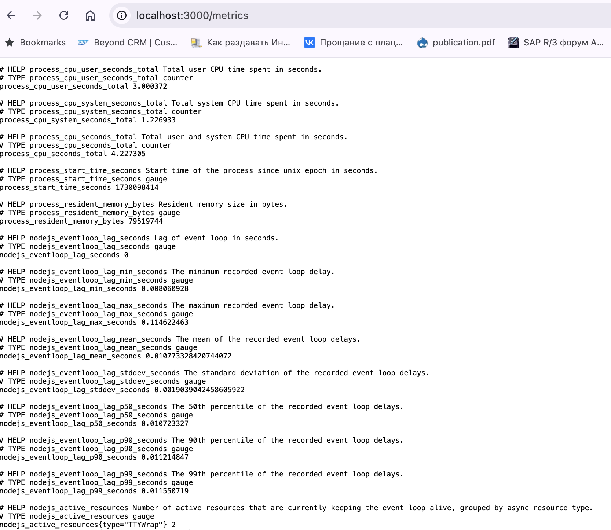
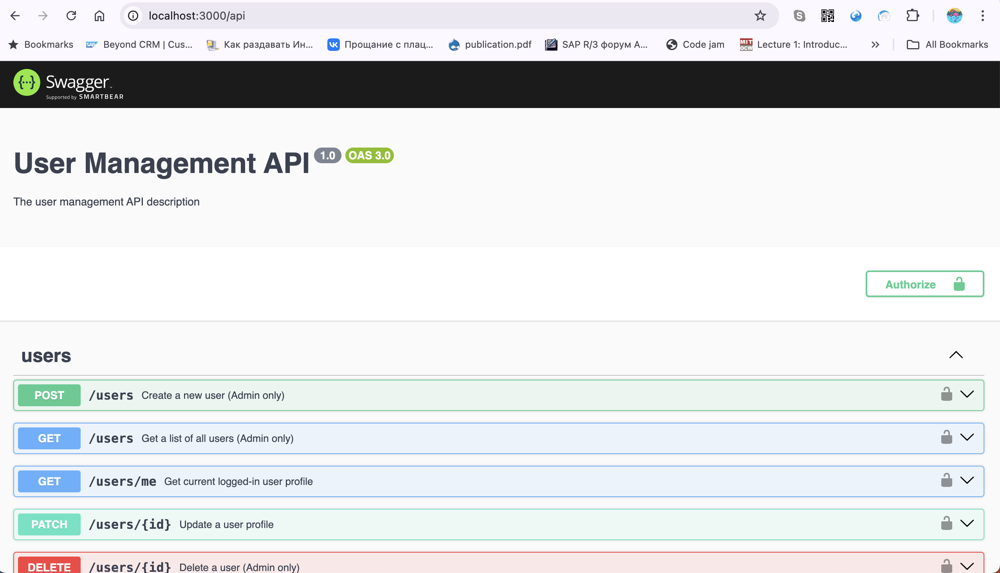
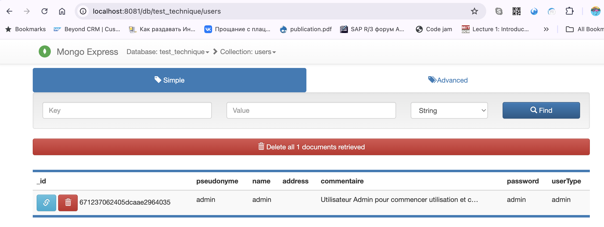

## Démarrer l'application

### Local

```
npm i
npm run build
npm run start
```

### Docker

#### Démarrer les conteneurs
```
npm run start:docker:full`
```



Aller sur le site `http://localhost:3000/api` pour voir Swagger.



### Créé premier utilisateur

On a besoin de cree premier utilisateur (admin) pour faire autorisation et utiliser l'application

```
docker exec -it mongo_for_test_technique bash
mongosh -u <MONGO_USERNAME> -p <MONGO_PASSWORD>
use <MONGO_DB>

db.users.insertOne({
  pseudonyme: "admin",
  name: "admin",
  address: "",
  commentaire: "Utilisateur Admin pour commencer utilisation et creer les autres utilisateur",
  password: "admin", // Change to a strong password
  userType: "admin"
});
```

Aller sur le site `http://localhost:8081/` pour acceder Mongo Admin console

Utiliser l'informations d'identification proposé:


Premier Admin a été créé



#### Arrêter les conteneurs
```
npm run stop:docker:full`
```
