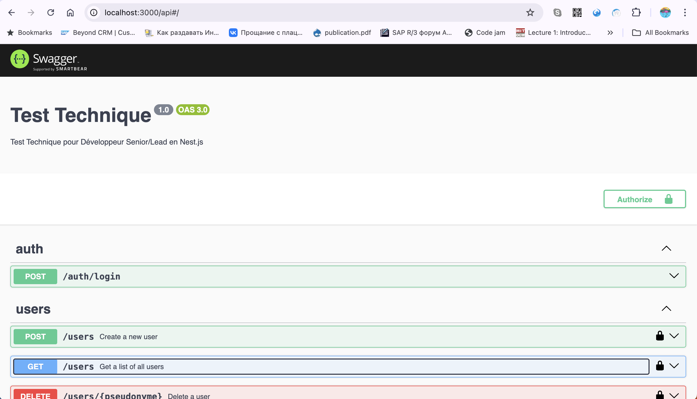
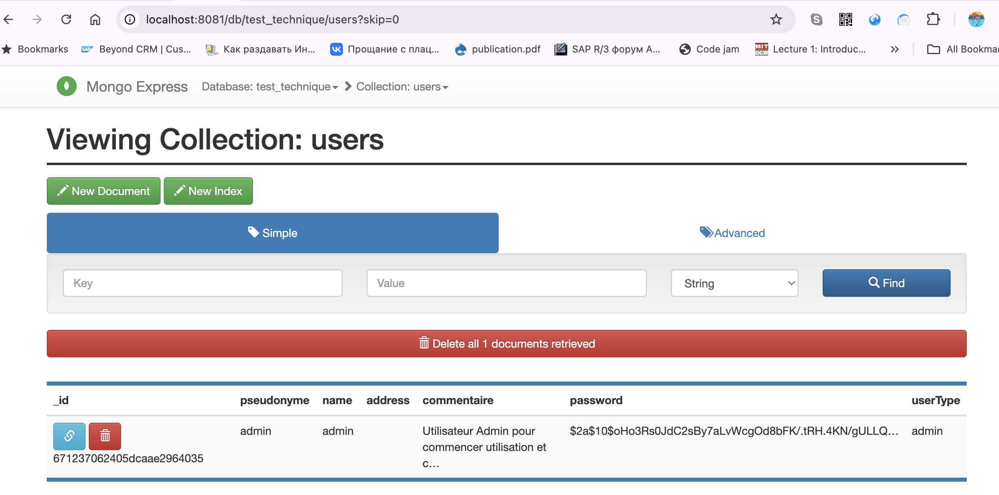
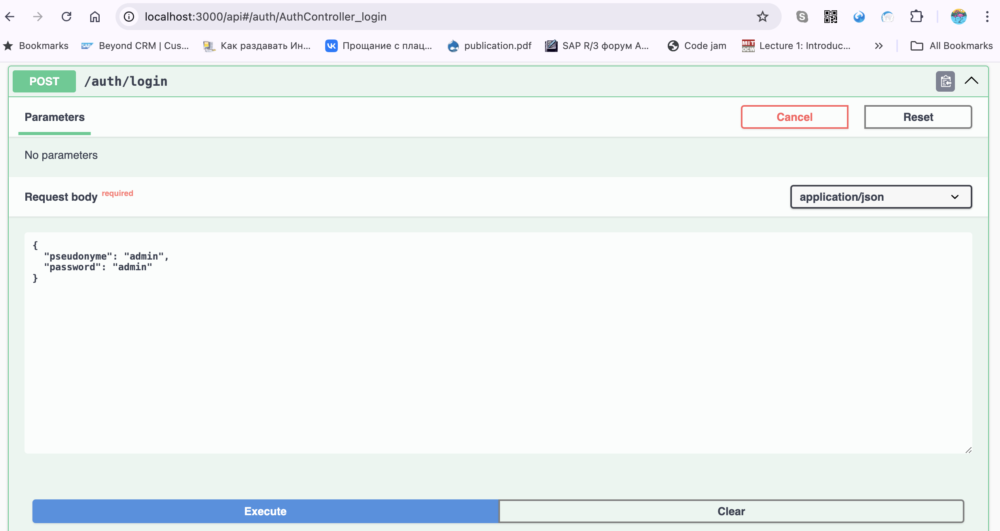
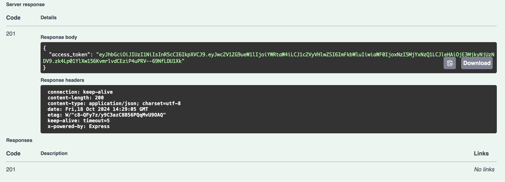
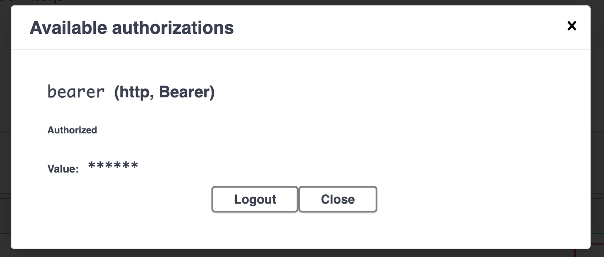

## Démarrer l'application

### Step 1: Lancer l'application et la base de données

[Aller sur le local (development + debug)](./docs/local.md)

ou 

[Aller sur le docker](./docs/docker.md)


### Step 2: Vérifiez si l'application est accessible via `localhost`

Aller sur le site `http://localhost:3000/api` pour voir Swagger.



### Step 3: Configurer le premier utilisateur administrateur pour gérer les utilisateurs

#### 3.1 Créé premier utilisateur

On a besoin de créer premier utilisateur (admin) pour faire autorisation et utiliser l'application;
On sauvegarde des mots des passe comme hashes. Pour premier Admin j'ai créé un script dans ./scripts/gererateHashWithSalt.js

```
docker exec -it mongo_for_test_technique bash
mongosh -u <MONGO_USERNAME> -p <MONGO_PASSWORD>
use <MONGO_DB>

db.users.insertOne({
  pseudonyme: "admin",
  name: "admin",
  address: "",
  commentaire: "Utilisateur Admin pour commencer utilisation et creer les autres utilisateur",
  password: "$2a$10$oHo3Rs0JdC2sBy7aLvWcgOd8bFK/.tRH.4KN/gULLQBtlV7Hy8Ndy"
  userType: "admin"
});
```
#### 3.2 Vérifiez si `mongo-express` est accessible
Aller sur le site `http://localhost:8081/` pour accéder Mongo Admin console

Utiliser l'informations d'identification proposé:


Premier Admin a été créé


### Step 4. Utiliser Swagger API

#### Créé jwt token pour lancer l'utilisation de Swagger
En utilisant Swagger API (`http://localhost:3000/api`) c'est possible de verifier tout les APIs.

En utilisant l'utilisateur Admin on a créé, c'est possible d'optenir un JWT token:



Apres l'execution, le token est disponible comme un reponse d'appel:



Apres l'authirisation, c'est possible d'utiliser tout les fonctions secutisé
